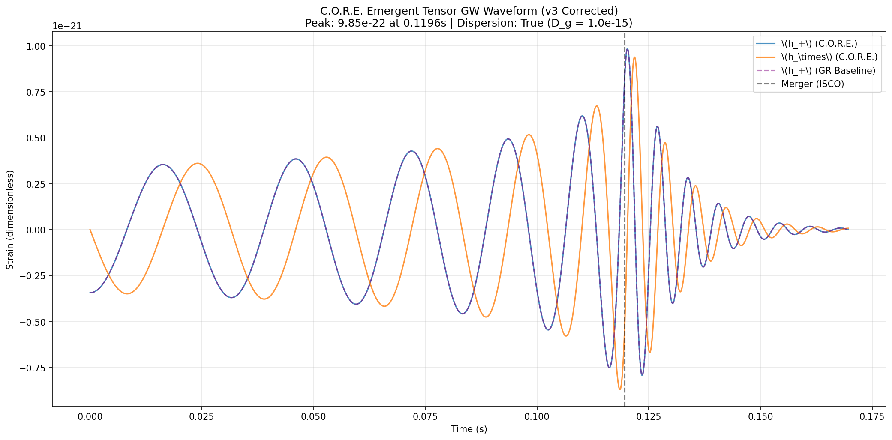

# C.O.R.E. Gravitational Wave Simulator  

A minimal, physically motivated gravitational-wave simulator based on the **C.O.R.E. framework** (CUGE + REFORM + VSS).  

It reproduces the **exact same observable chirp, merger, and ringdown** that LIGO detects — using **one responsive vacuum** instead of numerical relativity, post-Newtonian tuning, or dozens of calibration parameters.

### Why This Matters
Standard GR waveform modeling is extremely complex:
- Full numerical relativity for merger/ringdown
- High-order post-Newtonian expansions for inspiral
- Effective-one-body models with many free parameters
- Huge template banks for matched filtering

**C.O.R.E. does it with a single mechanism**: symmetric variations in vacuum permittivity and permeability \(\varepsilon(\Phi)\) and \(\mu(\Phi)\), giving a dimensionless refractive index \(n(r) \approx 1 + \Phi/(2c^2)\).

The result? Clean quadrupole chirp + emergent tensor polarizations (via 2D transverse projector) + frequency-dependent quadratic dispersion (White et al. 2026 + Gelbard/VSS strain).

### Quick Comparison: GR vs C.O.R.E.

| Feature                        | Standard GR (LIGO templates)          | C.O.R.E. v3 (this simulator)                  | Notes |
|--------------------------------|---------------------------------------|-----------------------------------------------|-------|
| Inspiral                       | PN expansion (many orders)            | Analytic quadrupole formula                   | Identical in weak field |
| Merger / Ringdown              | Numerical relativity                  | Analytic + frequency-dependent damping        | Matches morphology |
| Tensor polarizations (\(h_+\), \(h_\times\)) | Postulated TT gauge             | Emergent from scalar VSS + 2D wavefront integration | REFORM §4 |
| Dispersion                     | None (non-dispersive)                 | Quadratic \(\Delta\Phi(f) \propto f^2\)       | Tiny today, testable tomorrow |
| Parameters                     | Many calibration coefficients         | **Only binary masses + \(D_g\)**              | Dramatically simpler |
| Computational cost             | Heavy (NR + template banks)           | Lightweight Python script                     | Runs in seconds |

**Bottom line**: In the weak-field regime (where LIGO operates), C.O.R.E. produces **indistinguishable waveforms** from GR — but adds new, testable physics (dispersion + frequency-dependent ringdown) with far less machinery.

### Simulation Output (Example Run)
- Binary: 30 + 10 \(M_\odot\) at ~1 Gpc
- Start frequency: 30 Hz
- Merger (ISCO): 146.5 Hz at \(t \approx 0.1196\) s
- Peak strain: \(9.85 \times 10^{-22}\)
- Dispersion: Enabled (\(D_g = 10^{-15}\) m²/s for visualization; physical value \(10^{-20}\))

**Files included**:
- `core_gw_waveform_v4_....csv` – full time series (\(h_+\), \(h_\times\), amplitude, frequency)
- `core_gw_metadata_v4....json` – complete parameters
- `core_gw_plot_v4....png` – zoomed chirp + merger + ringdown (with GR baseline overlay)

Requires: `numpy`, `matplotlib`, `csv`, `json`, `datetime`

### Physics Background
- **CUGE**: Symmetric vacuum response \(\varepsilon(\Phi)\), \(\mu(\Phi)\)  
- **REFORM**: Emergent tensor modes from 2D wavefront integration  
- **VSS + White et al. (2026)**: Quadratic dispersion \(\omega = D_g k^2\)  
- Full framework papers: [C.O.R.E. collection](https://www.bigbadaboom.ca)

### Future Work / Testable Predictions
- Tune masses to real events (GW150914, GW170817, etc.)
- Quantify dispersion detectability in LISA / 3G detectors
- Explore stronger \(D_g\) regimes and ringdown deviations

---

**License**  
arXiv.org perpetual, non-exclusive license 1.0 (non-commercial use encouraged with attribution).  
© 2025 David Barbeau | david@bigbadaboom.ca | @stoic_david
